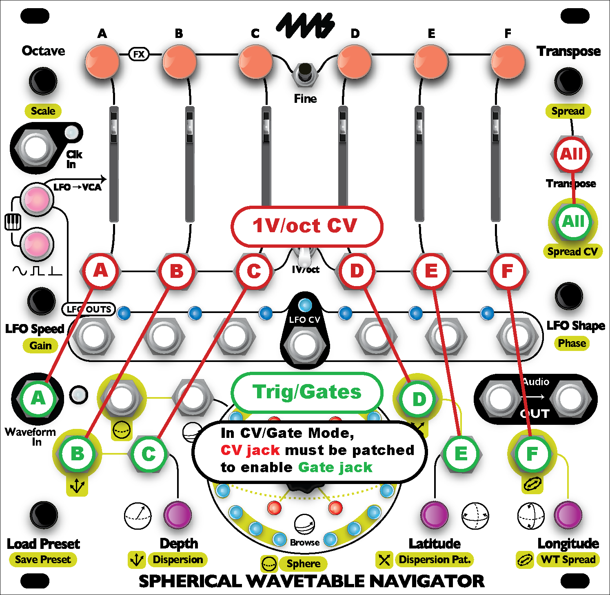

# Spherical Wavetable Navigator

## Firmware updates

### Where to get updates
You can always download the latest updates at the [4ms Company SWN page] (https://4mscompany.com/SWN).

### How to tell what version you have
When the module powers on, the version is displayed with a red and blue light on the light ring. 
The red light on the inner rings shows the major version.
The blue light on the outer ring shows the minor version. For example if the version is 1.2 then the major version is 1, and the minor version is 2.

On the outer light ring, if you imagine it as a clock face, the light just to the right of 12:00 is 0. The next light going around clockwise is 1. Then next light clockwise is 2, etc. The inner ring counts the same but it starts at 1 (and goes to 6). If you would like a picture to help visualize this, see the [SWN User Manual](https://4mscompany.com/media/SWN/manual/SWN-manual-2.2.pdf), page 39.

#### Changes in v2.2:

Released Oct 12, 2020
  
  * CV/Gate/Sustain mode added:
    * Similar to CV/Gate mode, but envelopes are sustained if gate is sustained
    * Channel A uses Sphere CV jack instead of Waveform In jack

  * Channel Panning
    * Each channel can be panned Left/Right by holding down channel button and moving the channel slider
    * Volume setting is cached and only updated when slider returns to original position
    * Pan settings are saved and recalled with presets
  
  * Select Bus
    * SWN will respond to Select Bus commands to load or save presets
    * Loading and/or saving can be disabled by holding down Preset and channel B button, and then pressing the small LFO buttons to enable or disable Loading (green LFO->VCA button) or Saving (red LFO Type button)
    * Settings are saved after power down
    * Responds to verbose style commands (e.g. Malekko Varigate) and terse style (e.g. Makenoise Rene mk2)
 
  * SWN now boots up into the last preset that was saved or loaded.

#### Changes in v2.1:

Released July 16, 2019

  * Chords in the list of chords (Spread knob or CV) have been modified:
    * Chord 9: First note lowered by one semitone to make a minor third.
    * Chord 17: Top note lowered three semitones to make a major 9th.
    * Chord 18: Top two notes lowered three semitones to make a major 11th.
    * Chord 25: Top note lowered three semitones to make a minor 9th.
    * Chord 26: Top two notes lowered three semitones to make a minor 11th.

  * Spread CV response changed so you can select any of the 26 chords with the black keys on a keyboard (C#0 to C#5)
 
  * Spread knob had a bug where sometimes turning clockwise from the first chord would go to chord 25, instead of 26.
  
#### New features in v2.0:

Released July 12, 2019

  * __CV/Gate Mode__: New mode allows you to patch gate signals into the CV jacks to trigger each channel's envelope. CV/Gate mode is designed for connecting a CV/Gate keyboard or sequencer: up to seven CV/Gate channels can be connected (six channel + one global).
    * To enter CV/Gate Mode: Press the two small buttons to switch from Mute Mode -> Note Mode -> Keyboard Mode -> CV/Gate Mode. The buttons will be dim orange in this mode.
    * CV/Gate mode is exactly like Keyboard Mode except that each channel's envelope can be fired by sending a gate or trigger into the a CV jack. When a cable is patched into a channel's V/oct jack, another jack will be re-purposed as a gate/trig jack for that channel:
       * Channel A's trigger: Waveform In jack
       * Channel B's trigger: Dispersion CV jack
       * Channel C's trigger: Depth CV jack
       * Channel D's trigger: Dispersion Pat. CV jack
       * Channel E's trigger: Latitude CV jack
       * Channel F's trigger: WT Spread CV jack
       * Global trigger: Spread CV jack
       * 

    * Note that in CV/Gate mode you can still use a CV jack for its primary feature if you either 1) don't plug into the associated 1V/oct jack, or 2) set that particular channel to Mute, Note, or Keyboard mode. For example, if you only patch 1V/oct CV into Transpose and a gate into Spread CV, then the CV jacks at the bottom will all retain their original purpose (Dispersion, Depth, etc..) 
    * A subtle difference between CV/Gate Mode and Keyboard mode is that pressing the buttons in CV/Gate mode will play the entire envelope even if you let go of the button early. In Keyboard mode, the envelope stops immediately when you release the button.
    * Like Note/Keyboard/Mute modes, you can have some channels in CV/Gate mode, and some in other modes. At least one channel has to be in CV/Gate mode to use Spread CV as a global trigger (and Transpose CV has to be patched).
    * All of the scale modes work in CV/Gate mode, including unquantized (light blue). It's up to you if you want your keyboard/sequencer to quantize, or your SWN, or both. Each channel can have a different scale selected as well.
    * Tip: If you're using a sequencer, you might want to patch its clock out into the SWN's Clk In jack so the envelope timings will be synced.

  * __Consistent Phase adjustments__: LFO Phase is now adjusted by in steps of 1/24 of the main clock. Previously it used a sequence of ratios which caused small timing differences when globally shifting the phase of all channels with respect to an external clock. LFO Fine Phase is still 1/12 of (Coarse) Phase, so it adjusts 1/288 of a measure per click.
  * __Shorter Envelopes__: Envelopes in Note and Key mode are now allowed to go much shorter.

#### New in Firmware v1.2 (not released publicly):

  * __Export Sphere__: in Sphere Recording Mode, enable Monitoring by pressing the green button. Then tap the center knob to export the sphere out the audio jack.
     *  You can use this to transfer your sphere to another SWN by patching the output of your SWN to the other SWN which is set to record a Sphere. 
     *  Or you can use this to backup a Sphere by recording the audio with a WAV Recorder, sampler or other audio recording device.
     *  Or you can record onto a WAV Recorder or computer and then open the file in SphereEdit.
  * __Record single waveform__: Pressing Fine + Record in Sphere Recording Mode will record over the current waveform only.
  * __Channel Locks__: press Fine + any channel button to lock/unlock a channel. 
     * The button flashes when a channel is locked, and the channel's light(s) will flash on the light ring.
     * Locked channels will not respond to any global parameter changes.
     * Locked channels will still respond to individual channel parameter changes (holding the channel button and turning a knob)
  * __Sphere Selection display__: When changing the Sphere (push and turn center knob), the outer light ring will display which channels are assigned to which Spheres (similar to the Octave display). The channel buttons will also change to the color of the channel's Sphere. Turning the WT Spread knob also activates this display. Tapping the center knob will show this display, too (useful for visualing the signal on the Sphere CV or WT Spread CV jacks). 
  * __Load/Clear Sphere__: In Sphere Recording Mode, turning the Preset knob allows you to load and clear Spheres in the same way you load presets (tap and tap again to load; hold for 8 seconds and then tap to clear). Cleared Spheres can be uncleared by immediately doing the clear button press.
  * __Enable/Disable Sphere__: In Sphere Recording Mode, turn the Preset knob to select a Sphere. Tap the WT Select knob to disable the selected Sphere. The sphere's light on the outer ring will flash rapidly to show it's disabled. 
     * To re-enable the sphere, do the same thing again.
     * When you exit Sphere Recording mode, disabled Spheres will not show up when selecting Spheres or using WT Spread. 
     * The set of enabled/disabled Spheres is saved in the Presets. So you can enable/disable different sets of Spheres to be used with each Preset. 
  * __Reset Nav/Sphere__: Press Preset + Depth to reset navigation (browse/lat/long/depth). Press Preset + Latitude to reset Sphere selections. You can still press Preset + Depth + Latitude to reset both navigation and sphere selection (just like in version 1.0 and 1.1)
  * Octave range is now -3 to +14 (formerly was 0 to +14).

#### Bug fixes:

  * Bug where LFO Speeds would be set to super slow speeds if LFO CV jack goes from high to low rapidly.
  
   
#### Improvements:

  * Setting each channel to a different octave, and then turning global octave all the way up or down, and then back to the original position does not clear the intervals between channels (just like how Transpose has always worked)
  * WT Spread now offsets the channels in a more consistant way by adding increasing amounts of space between channels.
  * LED display tuned so that turning knobs always has an immediate effect, even if all CV jacks are being used with rapidly changing CV

### Firmware v1.1
Released May 20, 2019

#### Bug fixes:

  * Fixed zippering sound when level changes rapidly (from internal or external LFO with sharp attack or decay).
  * Fixed position of white light on the outer light ring that shows which channels are not detuned. Bug only appeared when some channels were detuned and others were not detuned.
  * Fixed color of inner ring lights in Sphere Recording Mode for showing which waveform in the Sphere is selected. 
  * Fixed issue where loading a preset that contained a Scale would not refresh the channel pitches.
  
   
#### Improvements:

  * Softer distortion when clipping on the Waveform In jack
  * When entering Sphere Recording Mode, waveform 0,0,0 is selected and any Latitude, Longitude, or Depth offset is cleared. This ensures that Browsing will move through waveforms in the same order that they've been recorded.
  * When the SWN is showing the transpose/spread display, and mute buttons are pressed, the buttons now immediately show the new mute state.
  * Transpose/Spread display goes back to normal display mode more quickly.

  
### Firmware v1.0
  
Released May 3, 2019
  
First public version.